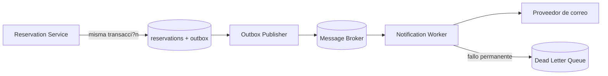

# An?lisis y dise?o de los dos fallos restantes

Este documento es la fuente del informe PDF final. Antes de entregar, debe incorporar las referencias exactas utilizadas por la pareja en su investigaci?n MLR.

## 1. Base de Datos Intermitente

### Por qu? ocurre

Una p?rdida intermitente de conectividad crea particiones breves entre Reservation/Inventory y PostgreSQL. El cliente puede observar timeout sin saber si la transacci?n nunca lleg?, fue abortada o se confirm? y se perdi? solamente la respuesta. Reintentar ciegamente una escritura puede duplicar la operaci?n.

En t?rminos de CAP, durante una partici?n un sistema que mantiene una ?nica autoridad consistente para inventario prefiere rechazar temporalmente operaciones antes que aceptar dos ventas incompatibles. La disponibilidad de escritura disminuye para preservar consistencia.

### Soluci?n de producci?n

- PostgreSQL de alta disponibilidad con r?plica s?ncrona y failover administrado.
- Timeouts cortos y pool de conexiones con l?mites.
- Retry exponencial con jitter ?nicamente para errores transitorios.
- Circuit Breaker para evitar presi?n continua sobre una base degradada.
- Claves de idempotencia para que repetir una solicitud no duplique reservas.
- M?tricas de conexiones, latencia, errores y failover.
- Backups y pruebas peri?dicas de restauraci?n.

### Pseudoc?digo

```text
crearReserva(comando, claveIdempotencia):
    existente = buscarPorClave(claveIdempotencia)
    si existente:
        retornar existente

    si circuitBreakerDB.estaAbierto():
        retornar ERROR_TEMPORAL

    para intento en 1..3:
        intentar:
            iniciar transaccion
            descontar inventario atomicamente
            guardar reserva con clave unica
            confirmar transaccion
            circuitBreakerDB.registrarExito()
            retornar CONFIRMED
        capturar errorTransitorio:
            deshacer transaccion
            esperar backoffConJitter(intento)

    circuitBreakerDB.registrarFallo()
    retornar ERROR_CONTROLADO
```

### Relaci?n con el prototipo

`chaos/gabo-base-datos-intermitente.ps1` apaga PostgreSQL, comprueba un error 5xx controlado y restaura el Deployment. Es una aproximaci?n de laboratorio; una prueba de red con Toxiproxy o NetworkPolicy representar?a mejor el flapping real.

## 2. Correo Perdido

### Por qu? ocurre

Notification es una dependencia no cr?tica: la reserva y el pago pueden completarse aunque el correo falle. Si Reservation guarda la compra y luego llama directamente al correo, existe un problema de doble escritura: el proceso puede caer entre la confirmaci?n en PostgreSQL y el env?o, dejando una reserva v?lida sin notificaci?n.

Exigir que el correo participe en la misma transacci?n har?a que una dependencia secundaria reduzca la disponibilidad del flujo principal. La soluci?n debe aceptar consistencia eventual para la notificaci?n.

### Soluci?n de producci?n: Transactional Outbox

Reservation guarda la reserva y un evento `ReservationConfirmed` dentro de la misma transacci?n PostgreSQL. Un publicador independiente lee la tabla outbox y env?a el evento a una cola. Notification consume el mensaje de forma idempotente, reintenta con backoff y mueve fallos permanentes a una Dead Letter Queue.



### Pseudoc?digo

```text
confirmarReserva(datos):
    iniciar transaccion
    guardar reserva CONFIRMED
    guardar outbox(eventId unico, tipo ReservationConfirmed, payload)
    confirmar transaccion
    retornar CONFIRMED

publicarOutbox():
    para evento pendiente:
        publicarEnCola(evento)
        marcarPublicado(evento.id)

consumirNotificacion(evento):
    si evento.id ya fue procesado:
        confirmar mensaje
        retornar

    intentar enviar correo con backoff
    si exito:
        guardar evento.id como procesado
        confirmar mensaje
    si supera maximo de intentos:
        mover a DLQ
```

### Relaci?n con el prototipo

`NOTIFICATION_FAILURE_MODE=drop` devuelve HTTP 503. Reservation conserva el pago y persiste `NOTIFICATION_PENDING`. Esto demuestra el fallback, mientras Outbox + cola representa la evoluci?n adecuada para producci?n.

## Comparaci?n

| Aspecto | Base intermitente | Correo perdido |
|---|---|---|
| Criticidad | Alta: inventario y reservas | Secundaria |
| Consistencia | Fuerte para impedir duplicados/sobreventa | Eventual |
| Respuesta inmediata | Error controlado si no se puede persistir | Reserva v?lida con notificaci?n pendiente |
| Defensa principal | HA, idempotencia, retry seguro y circuit breaker | Outbox, cola, consumidor idempotente y DLQ |

## Pendiente editorial para el PDF

- A?adir portada, integrantes y fecha.
- Incorporar citas de la investigaci?n MLR de la pareja.
- Exportar este contenido a PDF.
- Revisar que los diagramas se rendericen correctamente.
