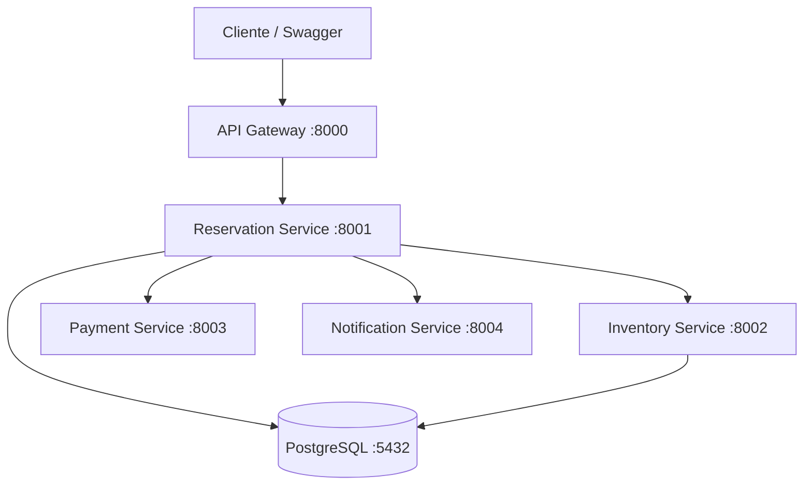
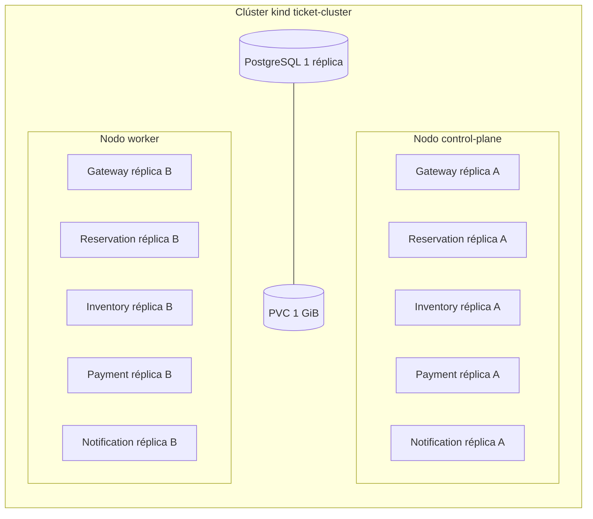
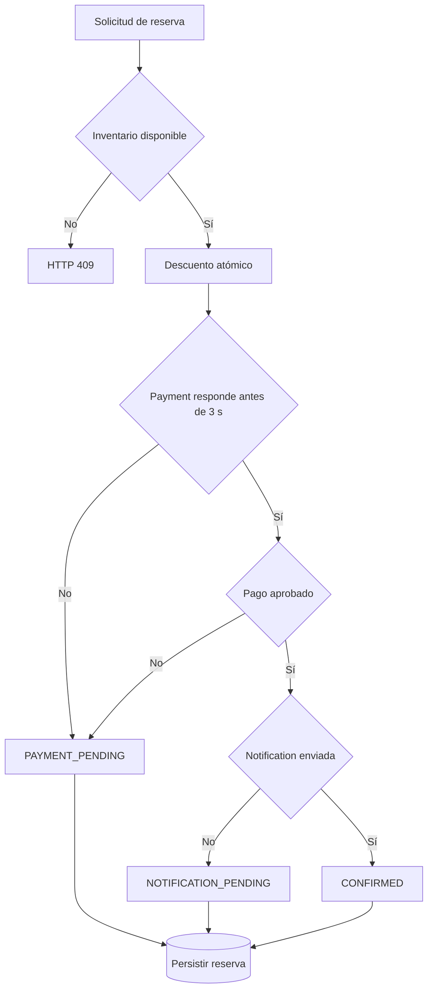

# Arquitectura multinodo

## Flujo lógico



Reservation Service coordina la reserva. Inventory realiza el descuento atómico, Payment decide el estado del cobro, Notification es una dependencia secundaria y Reservation persiste el resultado en PostgreSQL.

## Distribución Kubernetes

`kind-config.yaml` crea dos nodos: un `control-plane` y un `worker`. Los cinco servicios HTTP poseen dos réplicas y reglas de distribución preferida por `kubernetes.io/hostname`.



La posición de las réplicas A/B es una distribución esperada, no un nombre fijo de pod. Se confirma durante la demo con:

```powershell
kubectl get nodes -o wide
kubectl get pods -n ticket-system -o wide
```

PostgreSQL tiene una sola réplica y un PVC `ReadWriteOnce`; el nodo concreto lo decide el scheduler. Los componentes críticos Reservation e Inventory permanecen replicados entre los dos nodos.

## DNS internos

| Consumidor | Dependencia | URL interna |
|---|---|---|
| API Gateway | Reservation | `http://reservation-service:8001` |
| Reservation | Inventory | `http://inventory-service:8002` |
| Reservation | Payment | `http://payment-service:8003` |
| Reservation | Notification | `http://notification-service:8004` |
| Reservation e Inventory | PostgreSQL | `postgres:5432` |

Comprobación desde Reservation Service:

```powershell
powershell -ExecutionPolicy Bypass -File .\scripts\jordy-k8s.ps1 -Action dns
```

## Flujo de estados


