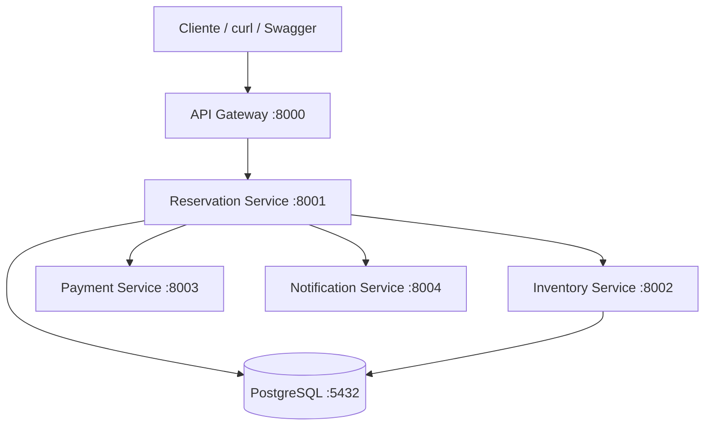
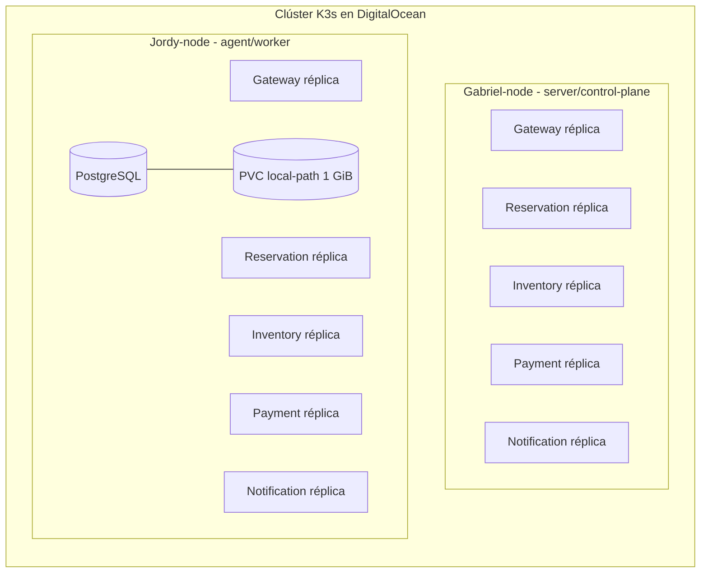
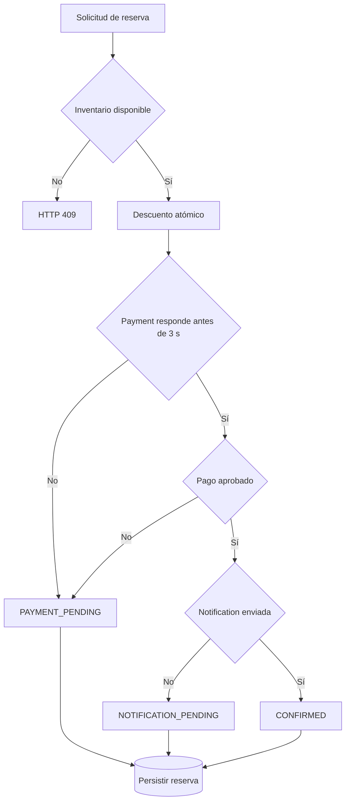

# Arquitectura multinodo final

## Infraestructura utilizada

La ejecución final de la práctica se realizó en **DigitalOcean** con dos Droplets Ubuntu unidos en un mismo clúster **K3s**:

| Nodo | Rol K3s | Función |
|---|---|---|
| `gabriel-node` | server / control-plane | API de Kubernetes, `kubectl` y ejecución de workloads |
| `jordy-node` | agent / worker | Ejecución de workloads y almacenamiento local de PostgreSQL |

No se utilizó KIND para la evidencia final. KIND permanece únicamente como entorno local de desarrollo.

## Flujo lógico



Reservation Service coordina la reserva. Inventory realiza el descuento atómico, Payment procesa o deja pendiente el cobro, Notification es una dependencia no crítica y Reservation persiste el resultado en PostgreSQL.

## Distribución Kubernetes/K3s

Los cinco servicios HTTP tienen dos réplicas y reglas de distribución preferida por `kubernetes.io/hostname`.



La posición exacta de cada pod puede cambiar durante rollouts, recreaciones y recuperación. Se verifica siempre con:

```bash
kubectl get nodes -o wide
kubectl get pods -n ticket-system -o wide
```

## PostgreSQL y almacenamiento

PostgreSQL tiene una sola réplica y usa un PVC `ReadWriteOnce` con `StorageClass=local-path`.

Durante la ejecución final el PV quedó asociado a `jordy-node`:

```text
Node Affinity:
  kubernetes.io/hostname in [jordy-node]
```

Por ello, la base de datos no puede reubicarse automáticamente en `gabriel-node` conservando ese mismo volumen local. Esta limitación es conocida y se documenta explícitamente.

La prueba de disponibilidad de nodo se realiza drenando `gabriel-node`, de forma que PostgreSQL y las réplicas sobrevivientes permanezcan en `jordy-node`.

En una arquitectura de producción se sustituiría `local-path` por almacenamiento compartido/replicado y se utilizaría PostgreSQL con una estrategia HA.

## DNS internos

| Consumidor | Dependencia | URL interna |
|---|---|---|
| API Gateway | Reservation | `http://reservation-service:8001` |
| Reservation | Inventory | `http://inventory-service:8002` |
| Reservation | Payment | `http://payment-service:8003` |
| Reservation | Notification | `http://notification-service:8004` |
| Reservation e Inventory | PostgreSQL | `postgres:5432` |

Comprobación final ejecutada desde Reservation Service:

```bash
kubectl exec -n ticket-system deployment/reservation-service -- \
  python -c "import socket; names=['inventory-service','payment-service','notification-service','postgres']; [print(n, '->', socket.gethostbyname(n)) for n in names]"
```

Los cuatro nombres resolvieron correctamente a sus respectivos `ClusterIP`.

## Flujo de estados



## Alta disponibilidad demostrada

La prueba adicional de nodo siguió este flujo:

1. Ambos nodos `Ready` y réplicas distribuidas.
2. `kubectl drain gabriel-node --ignore-daemonsets --delete-emptydir-data`.
3. `gabriel-node` pasó a `Ready,SchedulingDisabled`.
4. Las réplicas sobrevivientes y PostgreSQL continuaron en `jordy-node`.
5. Se abrió port-forward al Gateway sobreviviente de `jordy-node`.
6. Se creó una reserva completa con estado `CONFIRMED`.
7. Se ejecutó `kubectl uncordon gabriel-node`.
8. Kubernetes volvió a programar las réplicas pendientes.
9. Se verificó una nueva reserva `CONFIRMED` después de recuperar el clúster.

Esta prueba representa una **retirada controlada de workloads**, no un apagado eléctrico instantáneo del control-plane.
